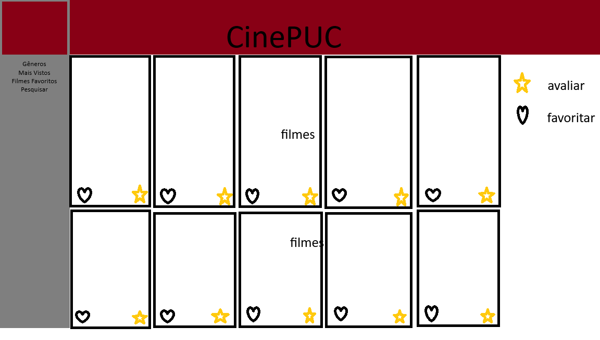
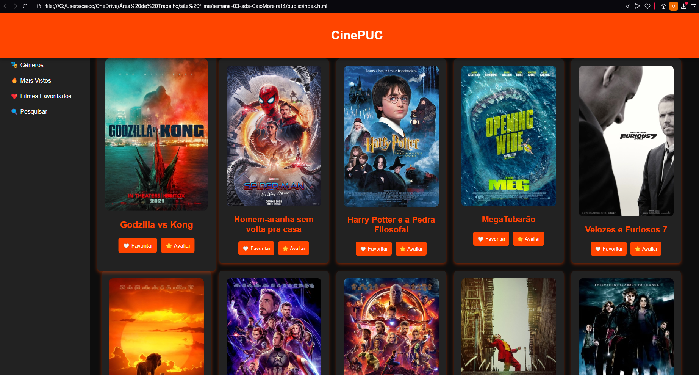

# Trabalho Prático - Semana 03

Dessa vez, vamos escolher uma proposta de projeto para trabalhar. Na [lista de propostas de projetos](propostas-projetos.md), escolha um dentre as alternativas.

Nessa atividade, você deverá montar a página inicial do projeto escolhido, a organização do HTML aplicando semântica correta e uso aprimorado do CSS. Leia o enunciado completo no Canvas para mais detalhes.

**IMPORTANTE:** Você deve trabalhar e alterar apenas arquivos dentro da pasta **`public`**. Deixe todos os demais arquivos e pastas desse repositório inalterados. **PRESTE MUITA ATENÇÃO NISSO.**

## Informações Gerais

- Nome: Caio Casarim Moreira
- Matricula: 891385
- Proposta de projeto escolhida: Catálogo de filmes
- Breve descrição sobre seu projeto: Um catálogo de filmes atuais com funções de: Avaliar filmes e favoritar filmes. Também ao lado esquerdo do site funções como: Gêneros, para visualizar gêneros diversos de filmes; Filmes favoritos, para ver seus filmes favoritados; Mais vistos, para pesquisar os filmes mais vistos do site; E uma barra de pesquisa, para procurar seu filme preferido.

## Print do esboço criada

<<  COLOQUE A IMAGEM AQUI >>

## Print da home-page criada

<<  COLOQUE A IMAGEM AQUI >>
